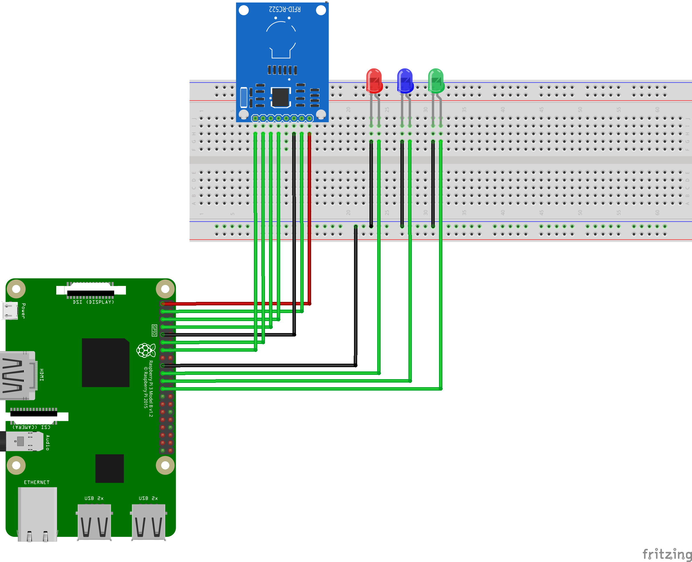

# coffeeGurdian

### Versionlog
Version 1.0 Release: ?? 
- Features
    - Lorem Ipsum
- Bugs
    - Lorem Ipsum

### BOM
| Pieces | Part | alternative| 
| -------- | ------- | -------|
| 1x |RaspberryPi Zero with wireless | NodeMCU |
| 1x | Micro SD-Card (for RaspberryPi OS Lite)| |
| 1x | MFRC522 NFC-Module| any other NFC-Module which works with Raspberrypi / Arduino|
| 1x | Red LED| RGB LED|
| 1x | Green LED| RGB LED|
| 1x | Blue LED| RGB LED|
| ?kg | Filament () | any other housing|
| ?m | Twisted Pair wire | any other wire |
|optional: | | |
| 2 | LAN ports | |
| 2 | LAN connector | |
| 4 | LAN cap | |

### Wiring

*Green = Data wires, red = 3,3V wire, black = ground